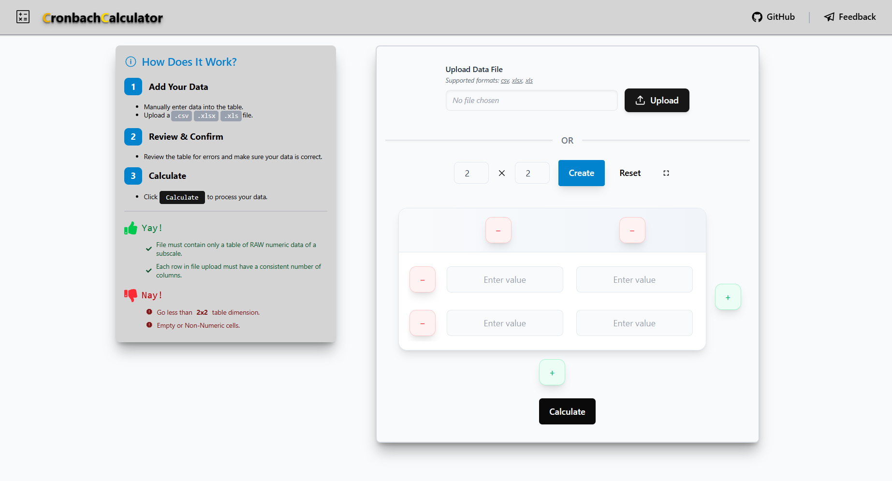

# Cronbach's Alpha Calculator

> A lightweight web app tool to calculate Cronbach's alpha (α) that accepts CSV, XLSX, and XLS files.

 

*Check it out:* [https://cronbach-calc.vercel.app/](https://cronbach-calc.vercel.app/)

## Supported File Extensions

- **XLSX / XLS**
- **CSV**

## Features

- **Input Modification** - Edit and adjust data from file uploads or manual input
- **Formula Breakdown** - View step-by-step calculation process
- **Statistical Analysis** - Detailed variance and mean calculations

## Built with

- **React JS + Vite (SWC)**
- **TailwindCSS**

## TODO

- [ ] better table navigation for large datasets to improve ux
- [ ] other reliability assessment methods (?)

## Validation

Verified against existing <a href="https://www.canva.com/design/DAGv_1uZTjU/5WjqaU-uwj2cLHTULlKvFQ/view?utm_content=DAGv_1uZTjU&utm_campaign=designshare&utm_medium=link2&utm_source=uniquelinks&utlId=ha097b70846" target="_blank" rel="noopener noreferrer">calculators and references</a> for accuracy testing.

## Notes

This is a personal project built to learn web frameworks, particularly JavaScript, and TailwindCSS styling. Gained experience with JavaScript fundamental syntax, Tailwind commands, code formatting tools (`eslint`, `prettier`), various deployment platforms, and <a href="https://react-icons.github.io/react-icons/" target="_blank" rel="noopener noreferrer">react-icons</a>, such a great find.

*Send your feedbacks <a href="https://tally.so/r/m6BXP5" target="_blank" rel="noopener noreferrer">here</a>.*

## Credits

- [Uedufy](https://uedufy.com/how-to-calculate-cronbachs-alpha-in-excel/) — Interpretation reference tables, validation reference
- [Eugene O'Loughlin](https://youtu.be/Hgf22LMcOHc) — Validation reference  
- [Wessa, P. (2025), *Free Statistics Software*, Office for Research Development and Education](https://www.wessa.net/rwasp_cronbach.wasp#cite) — Validation reference  
- [Cogn-IQ](https://www.cogn-iq.org/statistical-tools/cronbach-alpha.html) — Validation reference  
- [Datalab](https://datatab.net/statistics-calculator/reliability-analysis/cronbachs-alpha-calculator?example=Cronbachs_Alpha) — Validation reference  

